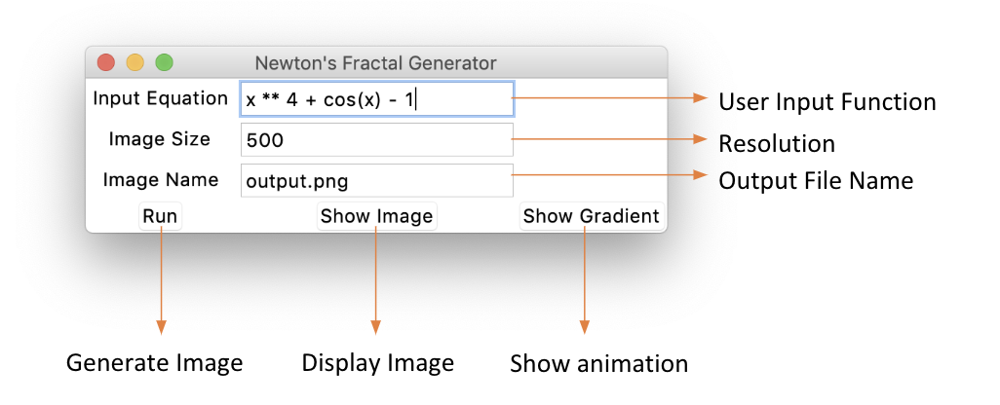

[](https://travis-ci.com/cs207-group-11/cs207-FinalProject)[](https://coveralls.io/github/cs207-group-11/cs207-FinalProject?branch=master)

# VayDiff

An Automatic Differentiation Library for Python 3. This project was done for CS207 at Harvard University, taught by Professor David Sondak.

## Group Number: 11

## Group Members

1. Abhimanyu Vasishth
2. Zheyu Wu
3. Yiming Xu

## Downloading `VayDiff`

Download our project on [PyPI](https://pypi.org/project/VayDiff/) using the following command:

```
pip install VayDiff
```

## A small example

```python
from VayDiff.VayDiff import Variable

x = Variable(3, name='x')
t = x + 2
print(t.val, t.der['x'])
5 1.0
```

## Using `Newton_fractal`

We provide a Graphical User Interface for our feature.


When we enter the function f(x)=x<sup>6</sup>-1, we will get the picture below:


When we click the `show gradient` button, we will get the animation of the root finding process. 


