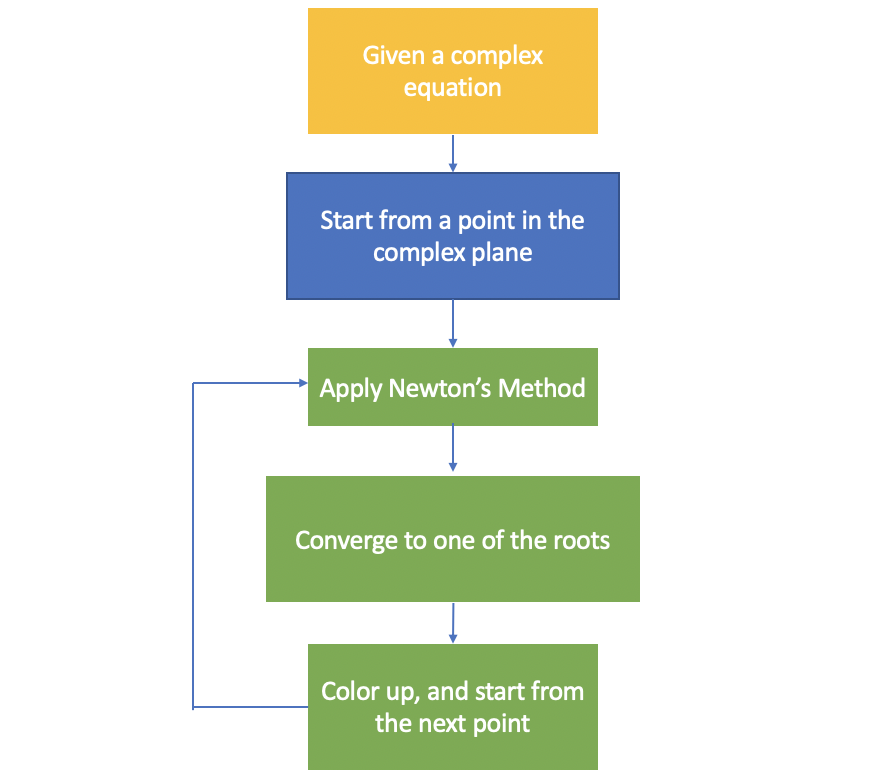

# Milestone 2: Group 11

## Introduction

Differentiation is an increasingly important technique in scientific computing [1]. One of the important applications of differentiation is gradient descent, a technique that is extensively employed in machine learning. Here, the gradient (i.e. multivariate differentiation) of a given function is used to find the minimum of a given cost function [2].

Despite its emerging importance, traditional approaches to compute the derivatives involve slow and complicated methods such as symbolic differentiation and numerical differentiation.  Both these approaches perform poorly on high-order and multivariate derivatives, which are essential for gradient-based optimization problems.

In this project, we introduce a software-based method to enable automatic differentiation to efficiently evaluate the derivative of a function. In addition to computing derivatives automatically, advanced methods such as back propagation will be included for complicated applications such as training a neural network. All of these methods will be incorporated in a well-documented Python package, `VayDiff`, that can be easily installed and allows users to perform a variety of tasks such as Newton’s method and gradient descent.

In addition to the automatic differentiation package, we also come up with a new feature `Newton_fractal`. This feature utlizes the automatic differention functionality provided by the VayDiff library, and extends it to the complex domain. By continuously applying Newton's method in solving complex equations with different starting points and coloring them up based on the root they converge to, we can get a Newton's Fractal shown below. 


<center>Figure 1. Newton's Fractal Example</center>


## Background

### Automatic Differentiation
To implement automatic differentiation, we will use the idea of forward mode differentiation and dual numbers. Forward mode differentiation builds on the chain rule, which allows computing derivatives of nested functions. We use the chain rule to evaluate derivative of such functions from the inside to the outside and introduce the dual number to help us compute the function values and the derivatives.

Similar to a complex number, a dual number has both a real part and a dual part. It can be defined in the form x+εx’  with the property that ε<sup>2</sup> =0. It follows that substituting the original variable with its associated dual number to a function, we ultimately get another dual number as follows:

                                        f(x+εx’)=f(x)+εf’(x)x’

In this new dual number, the real part is the numerical value evaluated at x and the dual part is the derivative of the function of interest at x. In this way, we convert the problem of evaluating symbolic derivative to the problem of simplifying a function of dual numbers.

Combining the idea of chain rule and dual number, we can calculate the derivative of complicated nested functions as well. The algorithm starts with identifying independent variables and replacing them with their dual numbers. With the help of chain rule, we can conduct operations on the dual numbers for our whole function as follows:

                          f(g(x+εx’))=f(g(x)+εg’(x)x’)=f(g(x))+εf’(g(x))g’(x)x’

Once again,  f(g(x)) is the value of the whole function and  f’(g(x))g’(x)x’ is exactly the derivative of interest. Extending this idea from univariate functions to multivariate functions, the output will be a gradient evaluated at a given point. If we take one step further and deal with multiple input functions (i.e. a vector of functions), the output will be a Jacobian matrix.

To illustrate this process graphically, we have created following schematic with two inputs x and y. Suppose the function of interest is f(x,y)=x<sup>2</sup>+3y and we want to get the derivative with respect to x when x=3 and y=4. First, we replace x with its dual number x=3+ε. Then,


We finally get 21+6ε where 21 is the value of the whole function and 6 is the derivative with respect to x.

### Newton Fractals

Fractal is a recursive, and infinitely self-similar mathematical set whose structure continuously repeats itself. Snowflake, as shown below, is a good example of fractals. 


<center> Figure 2. Snowflake </center>

Newton's fractal is the fractal generated by applying Newton's method to solve complex equations. As a review, Newton's method is a mathematical tool used to iteratively approximate the root of an equation given an starting point. Since a complex equation of polynomial order *n* can have up to *n* solutions in the complex plane, a random starting point in the complex plane can possibly converge to one of these *n* solutions using Newton's method. By applying Newton's method to all points confined in a square area in the complex plane and coloring them up based on the root they converge to, we can yield the so-called Newton's fractal. Figure 3 illustrates this process.



<center>Figure 3. Process of generating Newton's Fractal</center>

## How to Install and Use *VayDiff*

### Installing via PyPI (friendly for consumers)

Download our project on [PyPI](https://pypi.org/project/VayDiff/) using the following command:

```
pip install VayDiff
```

### Manual Installation (for developers)

Clone or download our [GitHub repository](https://github.com/HIPS/autograd) and navigate into this directory in your terminal.

Optional: create a virtual environment using `virtualenv`. This can be downloaded using `pip3` or `easy_install` as follows:

```
pip3 install virtualenv
```

or

```
sudo easy_install virtualenv
```

Then, create a virtual environment (using Python3), activate this virtual environment, and install the dependencies as follows:

```
virtualenv -p python3 my_env
source my_env/bin/activate
pip3 install -r requirements.txt
```

In order to deactivate the virtual environment, use the following command

```
deactivate
```

### Demonstration

*Note: a more detailed and interactive demonstration can be found in the accompanying Jupyter Notebook: `Demo_VayDiff.ipynb` and `Demo_Feature.ipynb`*

## Software Organization

The directory structure looks like the following:

```
VayDiff/
    __init__.py
    VayDiff.py
    BasicMath.py
    tests/
        __init__.py
        tests.py
	tests_jacobian.py
	tests_sec_der.py
	tests_vector.py
docs/
    schematic_fig.png
    milestone1/
    	milestone1.md
    milestone2/
    	demo.ipynb
	milestone2.md
    Final/
        demo_VayDiff.ipynb
	demo_Feature.ipynb
	documentation.md
   	
README.md
setup.py
LICENSE
requirements.txt
setup.cfg
setup.py
.gitignore
.travis.yml
```

In this directory, we have two Python modules, named `VayDiff.py` and `BasicMath.py`. `VatDiff.py` is the core of the project and contains the main algorithms and data structures. In addition, we include elementary functions (outlined in the implementation section) in the  `BasicMath.py` file. For scalar input, they work exactly like Numpy. However, if the input is Variable object, they will return another Variable object containing the results.

A series of tests are written to provide full coverage of all the functions and classes defined in VayDiff, and are stored in the `tests` folder. In order to facilitate code integration, we use `TravisCI` and `Coveralls` to automate the testing process for every commit and push to the Github repository.

## Implementation

### Core Classes, Data Structures and Important Attributes

As an overview, our core classes are `AutoDiff` class and `DualNumber` class. `AutoDiff` class is the interface between the program and the user, however under the hood `DualNumber` is extensively used to compute derivatives in the forward mode. `DualNumber` class will not be exposed to the user, however it is essential to the internal workings of the `AutoDiff` class. 

`AutoDiff` class consists of only one method: `auto_diff`, and it does not have any attributes. `auto_diff` takes three arguments: `function`, `eval_point` and `order`. The `function` is a user-defined function that needs to be differentiated, and `eval_point` is the point which the derivative will be computed at. The last argument is the order of derivative that the user wants to compute, and by default this value is set to 1. Through `auto_diff`, a real number (i.e. `eval_point`) is converted to a `DualNumber` class object. This `DualNumber` object is then passed to the function provided by the user for computing derivatives. For multivariate differentiation, `eval_point` will be a Python dictionary composed of key-value pairs. Each pair consists of variable name (e.g. ‘x’ or ‘y’), and its associated numerical value. `der` would also be a Python dictionary consisting of variable names as keys and their partial derivatives as values. In the case of vector functions of vectors, their partial derivatives will be returned as a Python list.

`DualNumber` class makes the aforementioned real-to-dual conversion possible. It has two key attributes: `self.val` and `self.der`, which are used to store the nominal value and its derivative respetively. Equally important, a collection of basic arithmetic functions are defined in this class to support binary operations (e.g. addition) between `DualNumber` class objects or real numbers. 

The `BasicMath.py` files takes basic arithmetic functions defined in `DualNumber` one step further. Other than binary operations, it provides support for more advanced functions such as logarithm and trigonometry. It calls Numpy's methods under the hood so its functionality should be identical to Numpy for scalar input. However, when the input is a `DualNumber` instance, it returns a `DualNumber` instance with the value and derivative computed accordingly. 

### Elementary Functions

At the moment, we cover the following functions

+ Basic functions that we overload: `add`, `subtract`, `multiply`, `divide`, `power`, `sqrt`, `pos` and `neg`
+ Trigonometric functions: `sin`, `cos`, `tan`, `arcsin`, `arccos`, `arctan`
+ Exponents and logarithms: `exp`, `log`

For the elementary functions listed above, we are in the advantageous position of knowing the form of the first derivative. For instance, we know analytically that the derivative of sin(x) is cos(x). Within each of our wrapper functions, we store the analytical derivative and return a dual number consisting of the value of the function as well as the derivative, which is where our implementation of basic functions differs from that of Numpy.

At the moment, we do not consider arbitrary functions defined by the user including while loops, if statements and recursions. We require that any function be composed of basic functions we defined in the `auto_diff` class. However, an interesting extension of this project would be to compute gradients of arbitrary functions that do not include only basic functions, and a great example of a library that deals with these is the [autograd python library](https://github.com/HIPS/autograd).

### External dependencies

`requirements.txt` outlines our external dependencies, which at the moment consists only of Numpy.

## Future

### Aspects yet to implement

Our implementation currently allows for a scalar function with a single variable input. We want to extend this to vectors, in order to compute gradients. This involves first, allowing the user to pass in a dictionary of variables and then storing the variables internally. Our existing dunder methods and `BasicMath` functions need to be modified to handle cases where the input is a dictionary rather than a single variable. Dealing with vector input would be the area where our code base would need the most changes.

We are also planning to implement some additional features, and would need to work on these for both scalar as well as vector cases. These are outlined below:

- Exponents and logarithms: log10, log2
- (optional) Hyperbolic functions: sinh, cosh, tanh, arcsinh, arccosh, arctanh

Finally, we plan to allow users to download our Python package via PyPI.

### Additional features

For the next milestone, we plan to implement following new features to fully utilize the automatic differentiation functionality:
(1) second order derivative
(2) Newton_fractual


## References
[1] M. T. Heath, “Scientific Computing: An Introductory Survey Chapter 8 - Numerical Integration and Differentiation,”[Online]. Accessed October 18th, 2018. Available: http://heath.cs.illinois.edu/scicomp/notes/chap08.pdf

[2] S. Ruder (2017, Jun, 15th), “An Overview of Gradient Descent Optimization Algorithms,”  *arXiv*.[Online]. Access October 18th, 2018. Available: https://arxiv.org/pdf/1609.04747.pdf
